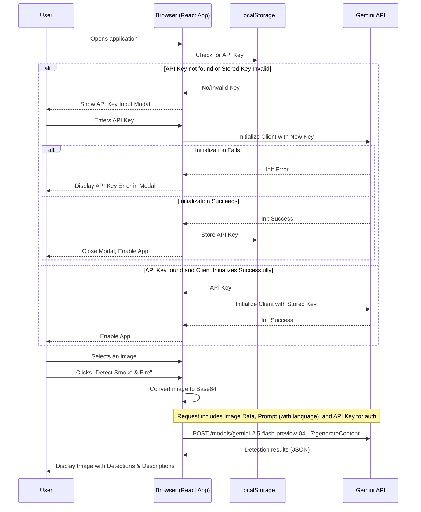

# Smoke & Fire Detection AI Vision App

This application leverages the Google Gemini API to detect smoke and fire within user-uploaded images. It highlights detected areas with bounding boxes and provides descriptions in either English or Vietnamese. The app is designed as a static website, making it easy to deploy on platforms like GitHub Pages and handles API key management securely by prompting the user for their own key.

## Features

*   **Image Upload:** Users can upload images (PNG, JPG, WEBP) for analysis.
*   **Smoke & Fire Detection:** Utilizes the Gemini API (`gemini-2.5-flash-preview-04-17` model) for multimodal analysis to identify smoke and fire.
*   **Bounding Box Overlay:** Detected instances are visually highlighted on the image using bounding boxes.
*   **Descriptive Details:** Provides textual descriptions for each detection.
*   **Multilingual Support:** UI and detection descriptions are available in English and Vietnamese.
*   **Client-Side API Key Management:** Users provide their own Gemini API key, which is stored locally in the browser's `localStorage` for convenience and security (the key is not stored in the codebase or on any server).
*   **Responsive Design:** The UI adapts to different screen sizes.
*   **Static Site Deployment:** Can be easily hosted on static site hosting services like GitHub Pages.

## Tech Stack

*   **Frontend:**
    *   **React 19:** A JavaScript library for building user interfaces.
    *   **TypeScript:** A superset of JavaScript that adds static typing.
    *   **Tailwind CSS:** A utility-first CSS framework for rapid UI development.
*   **AI & API:**
    *   **Google Gemini API (`@google/genai` SDK):** Used for the core image analysis and detection logic. The `gemini-2.5-flash-preview-04-17` model is specifically employed for its multimodal capabilities.
*   **Build/Environment:**
    *   **ES Modules (ESM):** Modern JavaScript module system, served directly via `esm.sh` for dependencies.
    *   **No Build Step Required for Deployment:** The project is structured to run directly in browsers that support ES modules and import maps.

## How It Works

The application operates entirely on the client-side (in the user's browser).

1.  **API Key Entry:**
    *   On first load, or if no valid API key is found in `localStorage`, the user is prompted to enter their Google Gemini API Key via a modal.
    *   This key is then stored in the browser's `localStorage` for subsequent sessions.
    *   The Gemini AI client is initialized using this user-provided key.
2.  **Image Upload & Processing:**
    *   The user selects an image file.
    *   The image is converted into a Base64 encoded string.
3.  **API Interaction:**
    *   The Base64 image data, along with a carefully crafted prompt (requesting smoke/fire detection, bounding boxes, and descriptions in the selected language), is sent to the Gemini API.
    *   The prompt guides the Gemini model to return a JSON response containing an array of detections.
4.  **Displaying Results:**
    *   The application parses the JSON response from the API.
    *   If detections are present, the original image is displayed on a canvas.
    *   Bounding boxes and labels (e.g., "FIRE", "SMOKE") are drawn onto the canvas over the detected regions.
    *   Textual descriptions of the detections are listed below the image.
5.  **Language Switching:**
    *   Users can toggle between English and Vietnamese.
    *   This changes all UI text and also modifies the prompt sent to the Gemini API to request descriptions in the chosen language.



## Setup and Deployment

This project is designed to run directly as a static website without a complex build process.

### Prerequisites

1.  **Google Gemini API Key:**
    *   You need a valid Google Gemini API key.
    *   You can obtain one by visiting [Google AI Studio](https://aistudio.google.com/app/apikey).
    *   **Important:** This application requires YOU to provide your own API key when running it. It will be stored in your browser's local storage and will NOT be committed to any repository or shared.
2.  **A Modern Web Browser:** Chrome, Firefox, Edge, Safari (recent versions that support ES Modules and Import Maps).
3.  **Web Server (for local development):** While you can open `index.html` directly, some browser security features (like CORS for certain operations, though not strictly needed here for API calls as they are proxied by esm.sh and handled by Gemini SDK) might work better if served. Simple options include:
    *   VS Code's "Live Server" extension.
    *   Python's `http.server`: `python -m http.server 8000` (or `python3`)
    *   Node.js's `serve`: `npx serve .`

### Running Locally

1.  **Clone the repository (or download the files):**
    ```bash
    git clone <repository-url>
    cd <repository-folder>
    ```
2.  **Open `index.html`:**
    *   Navigate to the project directory in your file explorer and double-click `index.html`.
    *   OR, if using a local web server, start it in the project's root directory and navigate to `http://localhost:PORT` (e.g., `http://localhost:8000`).
3.  **Enter API Key:**
    *   When the app loads for the first time, it will prompt you for your Gemini API Key. Paste your key into the modal and save.
    *   The application will then be ready to use.

## Project Structure

```
.
├── README.md                   // This file
├── index.html                  // Main HTML entry point
├── index.tsx                   // Main React app bootstrap
├── App.tsx                     // Main application component, state management
├── types.ts                    // TypeScript type definitions
├── metadata.json               // Application metadata
├── components/                 // React UI components
│   ├── ApiKeyModal.tsx         // Modal for API key input
│   ├── ImageDisplayWithDetections.tsx // Displays image and detection overlays
│   ├── ImageUploader.tsx       // Handles image selection and triggers upload
│   ├── LanguageSelector.tsx    // UI for switching languages
│   ├── Icons.tsx               // SVG Icon components
│   └── Spinner.tsx             // Loading spinner component
├── services/
│   └── geminiService.ts        // Logic for interacting with the Gemini API
├── utils/
│   └── fileUtils.ts            // Utility functions (e.g., file to base64)
└── localization/
    └── translations.ts         // Language strings for EN and VI
```